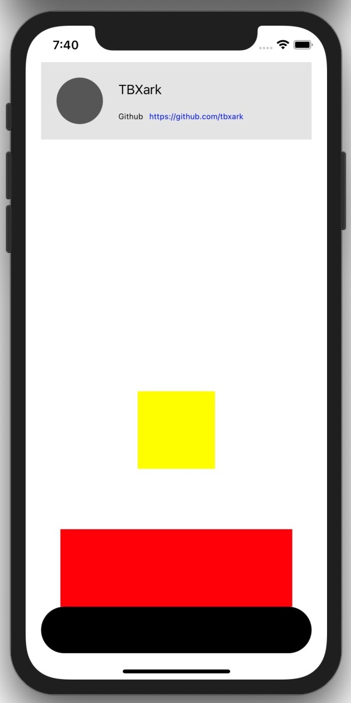

# FlexLayout

[](https://travis-ci.org/tbxark/FlexLayout)
[](https://cocoapods.org/pods/FlexLayout)
[](https://cocoapods.org/pods/FlexLayout)
[](https://cocoapods.org/pods/FlexLayout)


`FlexLayout` is a flexible layout tool similar to SwiftUI syntax， `ConstraintLayout` is the syntactic sugar of  `NSLayoutAnchor`.

## Example

To run the example project, clone the repo, and run `pod install` from the Example directory first.




```swift

FL.V(frame: view.bounds) {
    if #available(iOS 11.0, *) {
        FL.Space.fixed(self.view.safeAreaInsets.top)
    } else {
        FL.Space.fixed(20)
    }

    FL.Bind(userInfoContent) { rect in
        FL.H(size: rect.size) {
            FL.Space.fixed(20)
            self.avatarImgv.with(main: .fixed(60), cross: .fixed(60, offset: 20, align: .start))
            FL.Space.fixed(20)
            FL.Virtual { rect in
                FL.V(frame: rect) {
                    FL.Space.fixed(20)
                    self.titleLabel.with(main: .fixed(30))
                    FL.Space.grow()
                    FL.Virtual { rect in
                        FL.H(frame: rect) {
                            self.linkName.with(main: .fixed(40))
                            self.linkLabel.with(main: .grow)
                        }
                    }.with(main: .fixed(20))
                    FL.Space.fixed(20)
                }
            }.with(main: .grow)
            FL.Space.fixed(20)
        }
    }.with(main: .fixed(100), cross: .stretch(margin: (start: 20, end: 20)))
    FL.Space.grow()
    self.bottomBar.with(main: .fixed(60), cross: .stretch(margin: (start: 20, end: 20)))
    if #available(iOS 11.0, *) {
        FL.Space.fixed(self.view.safeAreaInsets.bottom)
    } else {
        FL.Space.fixed(20)
    }
}

CL.layout(clTest) {
    clTest.centerXAnchor |== view.centerXAnchor
    clTest.centerYAnchor |== view.centerYAnchor + 100
    (clTest.heightAnchor & clTest.widthAnchor) |== 100
}
CL.layout(clTest2) {
    clTest2.heightAnchor |== clTest.widthAnchor
    clTest2.widthAnchor |== clTest.widthAnchor * 2 + 100
    clTest2.centerXAnchor |== clTest.centerXAnchor
    clTest2.bottomAnchor |== bottomBar.topAnchor
}


```

## Requirements

Swift, iOS 9.0+


## Installation

FlexLayout is available through [CocoaPods](https://cocoapods.org). To install
it, simply add the following line to your Podfile:

```ruby
pod 'FlexLayout', :git=>'https://github.com/tbxark/FlexLayout.git'
```

## Author

tbxark, tbxark@outlook.com

## License

FlexLayout is available under the MIT license. See the LICENSE file for more info.
